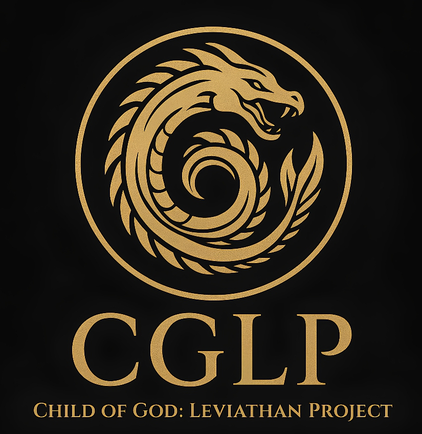

<!DOCTYPE html>
<html lang="id">
<head>
  <meta charset="UTF-8">
  <meta name="viewport" content="width=device-width, initial-scale=1.0">
  <title>Leviathan Project</title>
  
</head>
<body>
  <header>
    
    <h1>Child of God: Leviathan Project</h1>
    <nav>
      <a href="#verify">Verify Authenticity</a>
      <a href="#about">About the Abyss</a>
      <a href="#findus">Find Us</a>
    </nav>
  </header>

  <section id="verify">
    <h2>Verify Authenticity</h2>
    
Scan the QR code on your product to confirm it is an authentic Leviathan Project item.

    
QR Code

  </section>

  <section id="about">
    <h2>About the Abyss</h2>
    

      Leviathan Project is inspired by ancient mythic creatures of the deep. 
      Every product is crafted to honor the mysterious and the powerful forces of the abyss.
    

  </section>

  <section id="findus">
    <h2>Find Us</h2>
    

      Instagram: <a href="https://instagram.com/cglp" target="_blank">@cglp</a> 
      Shopee: <a href="#" target="_blank">Leviathan Project Official</a> 
      Contact: <a href="mailto:leviathan@example.com">leviathan@example.com</a>
    

  </section>

  <footer>
    &copy; 2025 Leviathan Project. All rights reserved.
  </footer>
</body>
</html>
